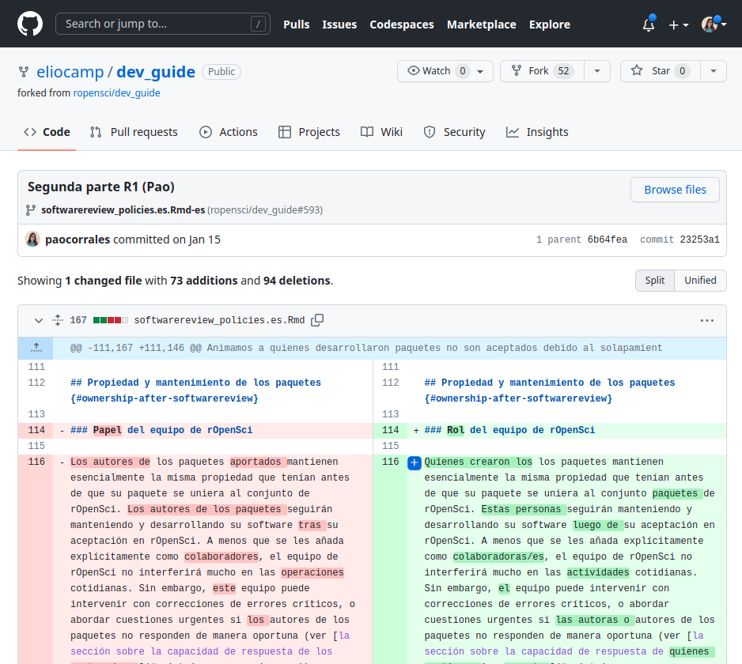
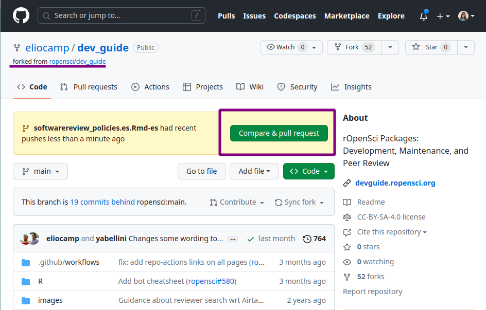
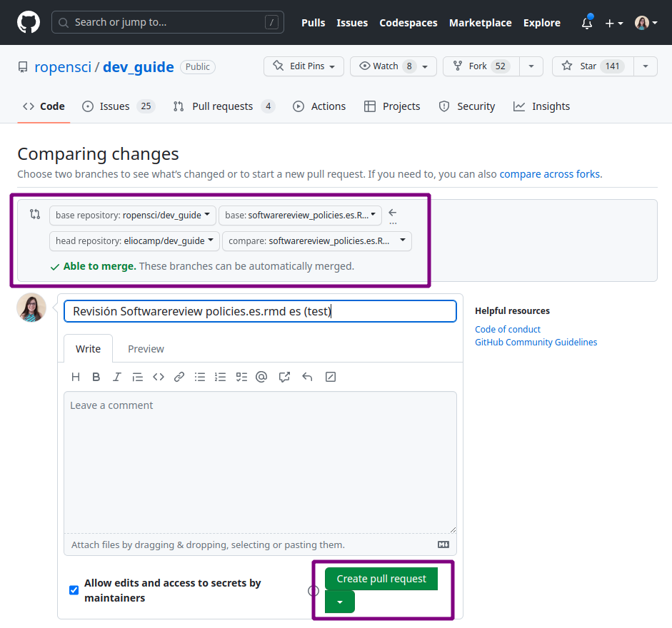

# Translation and Review Guidelines 

## Contributing

### Contributing to an existing project

If you're interested in contributing to an existing translation project, 
you'll need to 

1) get in touch with the people managing the project,
2) familiarize yourself with the source material to be translated, and
3) read this guide, paying close attention to the [language-specific guidelines](specific_guidelines.html)

You can contact a project manager to express your interest through email, Slack, or GitHub.
On the [list of active projects](https://github.com/ropensci-review-tools/translation_guide#active),
you will find information on each project, including the manager.
Each translation project also has a channel on the rOpenSci Slack where translation decisions are discussed and made, which are reflected in the [language-specific guidelines](specific_guidelines.html) in this guide and a glossary.

Do not hesitate to ask any questions you may have, 
such as general questions like "What is the expected time commitment?",
or technical questions like "What do I do if I run into problems on GitHub?"

### Proposing a new translation project

Starting a new translation project requires work and a commitment to the process, but can be a really rewarding experience!

Because multiple reviewers are required for all translations and there must be at least one active project manager, 
we recommend that those interested in starting a new translation project invite their local community to participate and form an initial team before starting the process.

If the language you are interested in translating does not have an [active project](https://github.com/ropensci-review-tools/translation_guide#active), please contact the rOpenSci team to propose it.
You can send an email to [info@ropensci.org](mailto:info@ropensci.org) or [open an *issue* in this repository](https://github.com/ropensci-review-tools/translation_guide/issues).

Please note that starting a new project requires a commitment to manage the repository where all the reviews will take place.
We ask that those proposing a new translation project commit to maintaining it for at least 2 years, 
or to finding a new maintainer if they must give it up within 2 years. 
This is the same [commitment we ask of our package maintainers](https://devguide.ropensci.org/softwarereview_author.html#planning-a-submission-or-a-pre-submission-enquiry).

## Technical aspects {#tech}

In this section we will use the [rOpenSci Packages: Development, Maintenance, and Peer Review](https://devguide.ropensci.org/) guide as an example, but all technical aspects apply to all other rOpenSci translations.

The source code that generates this material to be translated lives at [github.com/ropensci/dev_guide](https://github.com/ropensci/dev_guide), and is organized in .Rmd (R Markdown) files that contain text and sometimes also code.
In this case there are also some configuration files that need to be translated so that the workflow for creating the guide in the new language is fully translated.

Each chapter has one .Rmd file per language, with a suffix that identifies the language using its two-letter code (according to [ISO 639-1](https://en.wikipedia.org/wiki/List_of_ISO_639-1_codes)).
For example, the chapter "Software Peer Review Policies" will have its original English version in `softwarereview_policies.Rmd` and its translated Spanish version in `softwarereview_policies.es.Rmd`.

If the translation project is in progress, you will find a series of *pull requests*, **one for each file to translate**, generated with the babeldown package, containing the automatically translated text.
**Each of these *pull requests* has an associated *branch***.
For example, translations of the `pkg_ci.Rmd` file to Spanish would be found in the PR merging the `pkg_ci.es.Rmd-es-auto` branch, and called "Add Spanish automatic translation pkg_ci.es.Rmd".

In fact, if there are several translation projects going on at the same, you may encounter many *pull requests* for different files and different languages.
We recommend that you filter the *pull requests* using the tag for your language, for example the tag for Spanish translation is "traducción 🧉". You can also check the status of each *pull request* on the [GitHub project board](https://github.com/ropensci/dev_guide/projects) of each active language.

For security and organization, reviewers do not have write permission in the main repository.
The project manager will make a *fork* (we call this the **working repository**) and will give write permission to this fork to all the project contributors.
This *fork* will have the same *branches* as the main repository; this is key since the **review of each file will be done on the *branch* associated to its translation.** 
This means that a review of the Portuguese translation would happen on the `pkg_ci.pt.Rmd-pt-auto` branch, 
whereas the review of the Spanish translation would happen on the `pkg_ci.es.Rmd-es-auto` branch.

You're all set to start a review, but where do you start?
As in any collaborative project, it is important to agree among all the people to know what each one is going to do.
Again, we suggest you chat in the Slack channel to ask how the revisions will be divided. You can also comment in the *pull request* to ask if you can take the review of that chapter.

### Review 1

Let's say you had to do revision 1 of the chapter "Software Peer Review Policies" found in the `softwarereview_policies.en.Rmd` file.
Here are the steps to follow.

In your local repository:

1. Activate the *branch* associated with the file you are going to review.
    In our example it would be `softwarereview_policies.es.Rmd-en`.

2.  Open the `softwarereview_policies.es.Rmd` file.
    You may see things to improve immediately, as the automatic translation does a good but imperfect job.

3.  Start reviewing the text.
    For this we suggest you have the English version next to you, you may need to go back to the original version to understand the context of some phrase or word that the translator has not been able to translate correctly.
    For this you can use the web version of the material you are translating or the *"Files changed "* tab of the PR in the main repository.

    {alt="Screenshot of the GitHub interface showing the details of a pull request and the 'Files Changed' tab, which shows the original English text on the left and the translated text on the right."}

4.  Periodically, or when you complete the revision, you will have to make a *commit* with the changes you generated.
    Many times the content of the files will be extensive and you will need a lot of time to complete the revision.
    In these cases we suggest you make *commits* at least after each work session indicating in the message up to which line of the file you have reached.
    This way, if you need to delegate the review to someone else, that person can review the file history and pick up where you left off.

5.  So far the revision only lives in your local repository, the next step is to do a *push* to the working repository.
    It is very important that the *push* is to the *branch* associated to the file you are working on, otherwise we will not be able to connect your revision with the original translation.

6.  Once you have completed your revision, it is important that you notify the project coordinator or the person assigned to revision 2, if there is one.

#### Objectives of revision 1

The purpose of this first revision is to make a detailed reading of the machine translation in order to :

- Ensure that the meaning of the sentence or paragraph is maintained.

- Check that the glossary terms agreed upon by the community have been used according to the context.

- Apply stylistic decisions whenever possible.
    For example, in Spanish we decide to avoid gender marking of nouns and adjectives by paraphrasing sentences or using "las/los" if the former is not possible.

- Check that code blocks or Markdown markup have not been affected.

- Translate variable names and comments visible in the code blocks whenever appropriate.

Surely there are still some doubts and it is possible that some things may be overlooked.
Style decisions are often the most difficult to implement and sometimes it is necessary to consult with the rest of the team or discuss it later with the reviewer 2.

### Review 2

You got revision 2, great.
Again we will use as an example the chapter "Software Peer Review Policies" found in the `softwarereview_policies.en.Rmd` file.
Whoever did review 1, whom we will call **R1** of this chapter most likely generated one or more *commits* with changes over the original translation.
This means that your work does not start from scratch, here are the steps.

In your local repository:

1. Activate the *branch* associated to the file you are going to check.
    In our example it would be `softwarereview_policies.es.Rmd-en`.

2.  Do a *pull* to download all the changes R1 made and have the file updated.

3.  Start reviewing the text.
    To do this, we suggest you open the file history to view the changes R1 made.
    This will allow you to know if a phrase or word comes from the machine translation or from another human being.

    

    {alt="Screenshot of the GitHub interface showing the details of a commit, with automatically translated English text on the left and the revised text on the right."}

    

4.  Periodically, or when you complete the revision, you will have to make a *commit* with the changes you generated.
    Many times the content of the files will be extensive and you will need a lot of time to complete the revision.
    In these cases we suggest you make *commits* at least after each work session indicating in the message up to which line of the file you went.
    This way, if you need to delegate the review to someone else, they can review the file history and pick up where you left off.

5.  So far the revision only lives in your local repository, the next step is to do a *push* to the working repository.
    It is very important that the *push* is to the *branch* associated to the file you are working on, otherwise we will not be able to connect your revision with the original translation.

6.  Once you have completed your revision, the chapter is ready!
    However, this new version only lives in the working repository.
    You will have to open a *pull request* in the main repository to have it reviewed and approved by someone in an editor role.
    In the next section we will see how to open the *pull request*.

#### Objectives of Review 2

This second revision seeks to generate a text that maintains the original content but also sounds natural in the new language.
In order to achieve this, the following must be taken into account:

- That the use of terms according to the glossary and the specific context is respected.

- Use the format defined by the community, for example, use *italicized* format for words that remain in English.

- Apply style decisions missed by R1 or missed by R1.
    For example, in Spanish try to replace any "las/los" with a phrase without gender marking.

- That, in general, sentences are understood and sound good while avoiding literal translations.

In the process of revision 2 you may need to consult with R1 about the decisions they made or with the rest of the community if there is a phrase or term that raises doubts.
You may then suggest adding new terms to the glossary or updating this translation guide.

### Pull Request and editing of a chapter {#pr-edition}

Once the process of revising a chapter is complete, it is time to transfer that new version from the working repository to the main rOpenSci repository.
For this **R2** will have to open a *pull request* that compares the revised version with the machine translation only version.

1. Make sure that all changes are in the working repository and that you are working on the *branch* associated to the file under review, in our example it will be `softwarereview_policies.es.Rmd-en`.

If you are on the correct *branch*, in the GitHub web interface you will see the following:

GitHub identified that there are new changes (*pushes*) in the *branch* and suggests comparing them and making a *pull request* to the main repository.

3.  Click on the "*Compare & pull request" button.
4.  You will then have the option to modify the title of the *pull request* and leave a message. We suggest 2 things:
    1. Change the title to identify that it is a "Review".
        It is important to separate it from the *pull request* of the automatic translation.

    2.  In the body of the message, mention who is maintaining the translation project so that they are aware of the progress and can then continue with the process.
    

5.  Before creating the *pull request* it is **very important** that you check that it is done from the correct *branch*. This is the only way to connect the review work with the automatic translation and to be able to unify the versions correctly.
6.  And that's it! Click on "*Create pull request".

From this point on, the review is in the hands of the **maintainer** of the translation project.
This person must review the *pull* *request* and make queries to **R1** and **R2** before *merging* the *pull requests.

## General review

The revision process is a collaborative process in which, we hope, many people will participate.
This has the great advantage of incorporating different views on the use of language and generating a translation that represents the greatest number of people.
However, with all this diversity of views and despite the specific guidance of each language, it is possible that the revisions are heterogeneous, that sometimes different criteria are used or that there are simply typing errors.

For all these reasons, it is important that the translation project is completed with a global revision of all the material.
We strongly suggest that this overall review be carried out by one person in order to maintain a single criterion throughout the text.

Now **the translation is ready**.
Thank you and congratulations!
