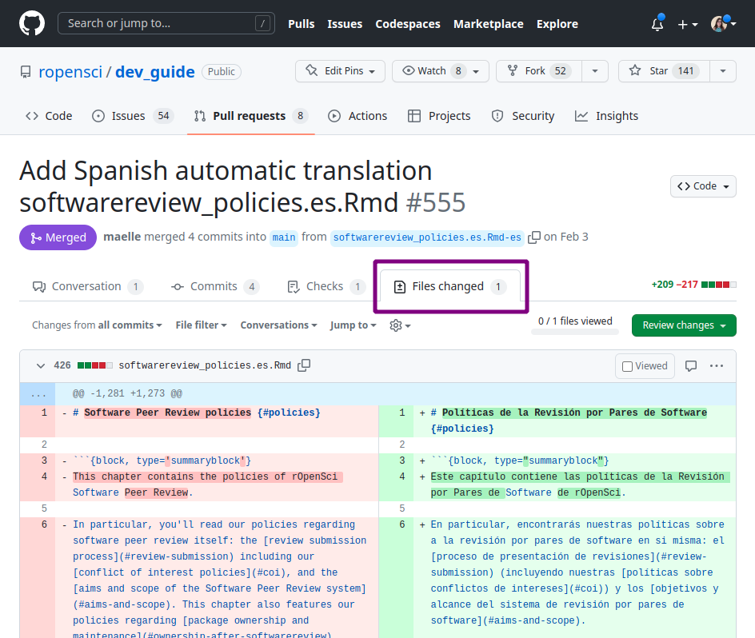

# Translation and Review Guidelines 

## How to contribute

### With an active language

You can check the list of languages for which there are active translation projects and their statuses [here](https://github.com/ropensci-review-tools/translation_guide#active).
There you will find the name of those who manage that language so you can get in touch and links to the active projects in that language.
Each translation project also has a channel on the rOpenSci Slack where translation decisions are discussed and made, which are reflected in the language-specific guidelines (LINK) in this guide and a glossary (LINK).

Before you start, it is important that you familiarize yourself with the source material.
In addition, we suggest that you read this guide (in particular the guidelines applicable to your language (LINK)) and contact the people who are already working on it.
Do not hesitate to ask any questions you may have, for example, how much time do you have to spend on it?
or technical questions like what if I run into problems on GitHub?

### With a new language

If your language is not among the languages with active projects listed [here](https://github.com/ropensci-review-tools/translation_guide#active), please contact the rOpenSci team to propose it.
You can send an email to [info@ropensci.org](mailto:info@ropensci.org) or [open a *issue* in this repository](https://github.com/ropensci-review-tools/translation_guide/issues).

Please note that starting a new project requires a commitment to manage the repository where all the review will take place.
We ask from those who manage translation projects the same commitment we ask from those who manage packages of our suite: 2 years of maintenance or we can find someone else to take over.

Also, since each chapter or article must be reviewed by at least 2 people, we recommend you to invite your local community before starting the process.

## Technical aspects of the review {#tech}

In this section we will use the rOpenSci Development Guide as an example, but all the technical aspects of doing a review also apply to other rOpenSci materials.

The source code that generates the Development Guide lives at [github.com/ropensci/dev_guide](https://github.com/ropensci/dev_guide), and is organized in .Rmd (RMarkdown) format files that contain text and sometimes also code.
In this case there are also some configuration files that need to be translated so that the guide in the new language is fully translated.

Each chapter has one .Rmd file per language, with a suffix that identifies the language using its two-letter code (according to [ISO 639-1](https://en.wikipedia.org/wiki/List_of_ISO_639-1_codes)).
For example, the chapter "Software Peer Review Policies" will have its original English version in `softwarereview_policies.Rmd` and its translated Spanish version in `softwarereview_policies.es.Rmd`.

If the translation project is running, you will find a series of *pull requests*, **one for each file to translate**, generated with the babeldown package containing the automatically translated text.
**Each of these *pull requests* has an associated *branch*, this will be important later.
In fact if there are many translation projects going on, you may encounter many *pull requests*.
We recommend you to filter using the tag associated to your language, for example the tag for Spanish translation is "traducción 🧉".

For security and organization, the reviewers will not have writing permissions in this main repository.
So whoever manages the project will have to make a *fork* (which we will call **working repository**) and give write permission to all the people who review or contribute.
This *fork* will have the same *branches* as the main repository; this is key since the **revision of each file will be done on the *branch* associated to its translation.

To start contributing the first thing you should do is to clone the working repository.
To find out where it is located, talk to the person in charge of the project or consult the Slack channel.
Once you have the work repository cloned, you can start working locally on your computer.

You're all set to start a review, but where do you start?
As in any collaborative project, it is important to agree among all the people to know what each one is going to do.
Again, we suggest you chat in the Slack channel to ask how the revisions will be divided.

### Review 1

Let's say you had to do revision 1 of the chapter "Software Peer Review Policies" found in the `softwarereview_policies.en.Rmd` file.
Here are the steps to follow.

In your local repository:

1. Activate the *branch* associated with the file you are going to review.
    In our example it would be `softwarereview_policies.es.Rmd-en`.

2.  Open the `softwarereview_policies.es.Rmd` file.
    You may see things to improve immediately, as the automatic translation does a good job but it is not perfect.

3.  Start reviewing the text.
    For this we suggest you have the English version next to you, you may need to go back to the original version to understand the context of some phrase or word that the translator has not been able to translate correctly.
    For this you can use the web version of the material you are translating or the *"Files changed "* tab of the PR in the main repository.

    {alt="Screenshot of the GitHub interface showing the details of a pull request and the 'Files Changed' tab, which shows the original English text on the left and the translated text on the right."}

4.  Periodically, or when you complete the revision, you will have to make a *commit* with the changes you generated.
    Many times the content of the files will be extensive and you will need a lot of time to complete the revision.
    In these cases we suggest you make *commits* at least after each work session indicating in the message up to which line of the file you have reached.
    This way, if you need to delegate the review to someone else, that person can review the file history and pick up where you left off.

5.  So far the revision only lives in your local repository, the next step is to do a *push* to the working repository.
    It is very important that the *push* is to the *branch* associated to the file you are working on, otherwise we will not be able to connect your revision with the original translation.

6.  Once you have completed your revision, it is important that you notify the project coordinator or the person assigned to revision 2, if there is one.

#### Objectives of revision 1

The purpose of this first revision is to make a detailed reading of the machine translation in order to :

- Ensure that the meaning of the sentence or paragraph is maintained.

- Check that the glossary terms agreed upon by the community have been used according to the context.

- Apply stylistic decisions whenever possible.
    For example, in Spanish we decide to avoid gender marking of nouns and adjectives by paraphrasing sentences or using "las/los" if the former is not possible.

- Check that code blocks or Markdown markup have not been affected.

- Translate variable names and comments visible in the code blocks whenever appropriate.

Surely there are still some doubts and it is possible that some things may be overlooked.
Style decisions are often the most difficult to implement and sometimes it is necessary to consult with the rest of the team or discuss it later with the reviewer 2.

### Revision 2

You got revision 2, great.
Again we will use as an example the chapter "Software Peer Review Policies" found in the `softwarereview_policies.en.Rmd` file.
Whoever did review 1, whom we will call **R1** of this chapter most likely generated one or more *commits* with changes over the original translation.
This means that your work does not start from scratch, here are the steps.

In your local repository:

1. Activate the *branch* associated to the file you are going to check.
    In our example it would be `softwarereview_policies.es.Rmd-en`.

2.  Do a *pull* to download all the changes R1 made and have the file updated.

3.  Start reviewing the text.
    To do this, we suggest you open the file history to view the changes R1 made.
    This will allow you to know if a phrase or word comes from the machine translation or from another human being.

    

    {alt="Screenshot of the GitHub interface showing the details of a commit, with automatically translated English text on the left and the revised text on the right."}

    

4.  Periodically, or when you complete the revision, you will have to make a *commit* with the changes you generated.
    Many times the content of the files will be extensive and you will need a lot of time to complete the revision.
    In these cases we suggest you make *commits* at least after each work session indicating in the message up to which line of the file you went.
    This way, if you need to delegate the review to someone else, they can review the file history and pick up where you left off.

5.  So far the revision only lives in your local repository, the next step is to do a *push* to the working repository.
    It is very important that the *push* is to the *branch* associated to the file you are working on, otherwise we will not be able to connect your revision with the original translation.

6.  Once you have completed your revision, the chapter is ready!
    However, this new version only lives in the working repository.
    You will have to open a *pull request* in the main repository to have it reviewed and approved by someone in an editor role.
    In the next section we will see how to open the *pull request*.

#### Objectives of Revision 2

This second revision seeks to generate a text that maintains the original content but also sounds natural in the new language.
In order to achieve this, the following must be taken into account:

- That the use of terms according to the glossary and the specific context is respected.

- Use the format defined by the community, for example, use *italicized* format for words that remain in English.

- Apply style decisions missed by R1 or missed by R1.
    For example, in Spanish try to replace any "las/los" with a phrase without gender marking.

- That, in general, sentences are understood and sound good while avoiding literal translations.

In the process of revision 2 you may need to consult with R1 about the decisions he/she made or with the rest of the community if there is a phrase or term that raises doubts.
You may then suggest adding new terms to the glossary or updating this translation guide.

### Pull Request and editing of a chapter

## General review
