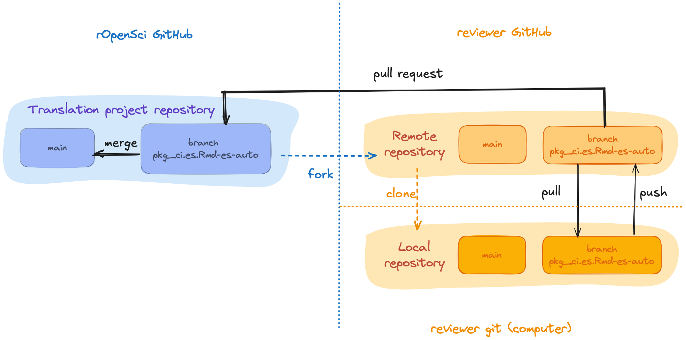

# Guía para traducir y revisar

## Cómo colaborar

### Contribuir a un proyecto activo

Si te interesa contribuir a un proyecto de traducción activo, antes de comenzar vas a tener que:

1) ponerte en contacto con las personas que mantienen el proyecto,
2) familiarizarte con el material que se va a traducir, y
3) leer esta guía, prestando especial atención a las [directrices específicas del idioma](specific_guidelines.html).

Puede ponerse en contacto con un responsable del proyecto para expresar su interés a través del correo electrónico, Slack o GitHub.
En la [lista de proyectos activos](https://github.com/ropensci-review-tools/translation_guide#active),
encontrarás información sobre cada proyecto, incluido las personas responsables de su mantenimiento.
Cada proyecto de traducción tiene un canal en el Slack de rOpenSci donde se discuten y toman las decisiones de traducción, que se reflejan en las [directrices específicas para cada idioma](specific_guidelines.html) de esta guía y en un [glosario](specific_guidelines.es.html#glosario-es).
Si te unes a un proyecto de traducción, nos aseguraremos de que recibas una invitación al canal de Slack.

Es una buena idea preguntar cómo se están dividiendo las tareas de revisión para que todo el mundo sepa de qué es responsable.

No dudes en preguntar cualquier duda que tengas, 
como preguntas generales como «¿Cuál es el compromiso de tiempo esperado?»,
o preguntas técnicas como «¿Qué hago si me encuentro con problemas en GitHub?».

### Proponer un nuevo proyecto de traducción

Empezar un nuevo proyecto de traducción requiere trabajo y compromiso con el proceso, pero puede ser una experiencia realmente gratificante.

Dado que se necesitan varias personas que revisen las traducciones y que debe haber al menos una persona activa manteniendoel proyecto , 
recomendamos que las personas interesadas en iniciar un nuevo proyecto de traducción inviten a su comunidad local a participar y formen un equipo inicial antes de comenzar el proceso.

Si tu idioma no está entre [los idiomas con proyectos activos ](https://github.com/ropensci-review-tools/translation_guide#active), ponte en contacto con el equipo de rOpenSci para proponerlo.
Puedes enviar un mail a [info\@ropensci.org](mailto:info@ropensci.org) o [abrir un *issue* en este repositorio](https://github.com/ropensci-review-tools/translation_guide/issues).

Ten en cuenta que iniciar un nuevo proyecto requiere el compromiso para gestionar el repositorio donde se llevará a cabo toda la revisión.
Pedimos a quienes propongan un nuevo proyecto de traducción que se comprometan a mantenerlo durante al menos 2 años, 
o a encontrar un quien lo mantenga si deben abandonarlo antes de los 2 años. 
Este es el mismo [compromiso que pedimos a quienes mantienen nuestros paquetes](https://devguide.ropensci.org/es/softwarereview_author.es.html#planning-a-submission-or-a-pre-submission-enquiry).

## Aspectos técnicos de la revisión {#tech}

### Directrices generales

En cada paso de este proceso, usamos las siguientes pautas:
  
1. Utiliza una voz conversacional en lugar de una voz formal o académica.

2. Si procede, especifica el dialecto o la variante lingüística regional utilizada.
Por ejemplo, la traducción al español utiliza las convenciones latinoamericanas.

3. Intenta ser neutral en cuanto al género.
  Si la lengua en la que estás trabajando tiene un género gramatical fuerte, la traducción ajusta la redacción para evitar asignar un género.
Cuando no se pueda evitar la marca de género, sigue las pautas especificas de cada lenguaje con respecto del uso de lenguaje inclusivo o no sexista. 

4. Intenta ser idiomático.
  No te preocupes por las traducciones literales. Acerca el mensaje a su audiencia[^intro-yani] eligiendo el texto y la forma en la lengua a traducir que mejor expresen el *significado* del fragmento del original.  

5. Toma distancia para revisar. 
  Cuando trabajamos mucho rato en un texto cuesta identificar errores de tipeo. 
Como sugerencia, una vez que termines la revisón del capítulo o sección deja pasar un tiempo (algunas horas o un día) antes de hacer la última lectura y enviarla para la siguiente revisión. Eso hace más fácil que salten a la vista este tipo de detalles y permite que quienes hagan la revisión se concentren 
en la calidad de la traducción más que en correcciones ortotipográficas. También es útil revisar el texto en una versión con formato (compilada como pdf o html), ya que seguramente algunos errores serán más visibles que en la versión cruda. Si tienes la posibilidad, una 
impresión en papel, tanto de la versión cruda como de la compilada, también ayuda a ver más claro los errores.

### Organization

En esta sección usaremos como ejemplo la guia "Paquetes de rOpenSci: Desarrollo, mantenimiento y revisión por pares", pero todos los aspectos técnicos para hacer una revisión también aplican a otros materiales de la organización.

El código fuente que genera la guía vive en [github.com/ropensci/dev_guide](https://github.com/ropensci/dev_guide), y está organizada en archivos con formato .Rmd (RMarkdown) que contienen texto y a veces también código de R.
En este caso también hay algunos archivos de configuración que requieren ser traducidos para que la guía en el nuevo lenguaje esté completamente traducida.

Cada capítulo tiene un archivo .Rmd por idioma, con un sufijo que identifica el idioma usando su código de dos letras (según [ISO 639-1](https://en.wikipedia.org/wiki/List_of_ISO_639-1_codes)).
Por ejemplo, el capítulo "Políticas de la Revisión por Pares de Software" tendrá su versión original en inglés en `softwarereview_policies.Rmd` y su versión traducida al español en `softwarereview_policies.es.Rmd`.

Si el proyecto de traducción está en marcha, encontrarás una serie de *pull request*, **uno por cada archivo a traducir**, generados con el paquete babeldown que contienen el texto traducido automáticamente.
**Cada uno de estos *pull requests* tienen una *branch* asociada**.
Por ejemplo, las traducciones del archivo `pkg_ci.Rmd` al español se encontrarían en el PR que fusiona la rama `pkg_ci.es.Rmd-es-auto`, y se llamaría "Add Spanish automatic translation pkg_ci.es.Rmd". 

De hecho si hay muchos proyectos de traducción en marcha, es posible que te encuentres con muchos *pull requests* de diferentes archivos y diferentes lenguajes.
Te recomendamos filtrar los *pull requests* usando la etiqueta asociada a tu lenguaje, por ejemplo la etiqueta para la traducción al español es "traducción 🧉". También podes ver el estado de cada *pull requests* en el [proyecto de GitHub](https://github.com/ropensci/dev_guide/projects) correspondiente a tu lenguaje.

Por seguridad y organización, quienes realicen la revisión no van a tener premiso de escritura en el repositorio principal.
De modo que quien está a cargo de mantener el proyecto deberá hacer un *fork* (que llamaremos **repositorio de trabajo**) y darle permiso de escritura a todas las personas que revisen o contribuyan.
Este *fork* tendrá las mismas *branchs* que el repositorio principal; esto es clave ya la **revisión de cada archivo se realizará sobre la *branch* asociada a su traducción.**
Esto significa que una revisión de la traducción al portugués ocurriría en la rama `pkg_ci.pt.Rmd-pt-auto`, 
mientras que la revisión de la traducción al español tendría lugar en la rama `pkg_ci.es.Rmd-es-auto`.

{alt="Diagramas que muestran cómo hacer un fork del proyecto de traducción desde rOpenSci GitHub al GitHub de la persona revisora y luego cómo clonar al repositorio git local.  El diagrama muestra que las tareas pull y push se realizan desde el repositorio local al remoto y que se realiza una pull request desde el repositorio remoto de la persona revisora al repositorio del proyecto de traducción de rOpenSci."}

Una vez que hayas [contactado con la persona responsable del proyecto](#contributing) y esté todo listo para que empieces a contribuir, 
lo primero que debes hacer es clonar el repositorio de trabajo.
Una vez clonado, puedes empezar a trabajar con el repositorio localmente en tu ordenador.

Si aún no has tenido una discusión sobre lo que vas a revisar, 
puedes preguntar en el canal de Slack o comentar un *pull request* para preguntar si puedes encargarte de la revisión de ese capítulo.
Te recomendamos encarecidamente que preguntes **antes** de empezar a trabajar en tu revisión. 

Ahora si, ¡empecemos a revisar!

### Revisión 1

El objetivo de esta primera revisión es hacer una lectura detallada de la traducción automática para:

- Asegurarse de que se mantiene el sentido de la frase o párrafo.

- Comprobar que los términos del glosario acordados por la comunidad se han utilizado de acuerdo con el contexto.

- Aplicar decisiones estilísticas siempre que sea posible.
    Por ejemplo, en español decidimos evitar el marcado de género de sustantivos y adjetivos parafraseando las frases o utilizando «las/los» si no es posible parafrasear.

- Comprobar que los bloques de código o el marcado Markdown no se hayan visto afectados.

- Traducir los nombres de las variables y los comentarios visibles en los bloques de código cuando proceda.

A menudo quedarán algunas dudas y es posible que se pasen por alto algunas cosas.
Las decisiones de estilo suelen ser las más difíciles de aplicar y a veces es necesario consultar con el resto del equipo o discutirlo más tarde con la persona que realizara la segunda revision.

Trabajando localmente en tu computadora, estos son los pasos a seguir para realizar una primera revisión de un archivo.

En tu repositorio local:

1.  **Activá la *branch* asociada al archivo que vas a revisar**.
    En nuestro ejemplo, como estas revisando `softwarereview_policies.en.Rmd` la *branch* sería `softwarereview_policies.es.Rmd-es`\`.

2.  **Abrí el archivo**, 
    por ejemplo `softwarereview_policies.es.Rmd`.
    Es posible que veas cosas para mejorar inmediatamente, ya que la traducción automática hace un buen trabajo pero no es perfecta.

3.  **Comenzá a revisar el texto.**
    Para esto te sugerimos tener la versión en inglés al lado, es posible que necesites volver a la versión original para entender el contexto de alguna frase o palabra que el traductor no haya podido traducir correctamente.
    Para esto puede usar la versión web del material que estás traduciendo o la pestaña *"Files changed"* del PR en el repositorio principal.

    {alt="Captura de pantalla de la interfaz de GitHub mostrando los detalles de un pull request y la solapa \"Files Changed\", la cual muestra el texto original en inglés a la izquierda y el texto traducido al español a la derecha."}

4.  * **Envia tus cambios haciendo *commit*.**
    Muchas veces el contenido de los archivos será extenso y necesitarás bastante tiempo para completar la revisión.
    En estos casos te sugerimos hacer *commits* al menos luego de cada sesión de trabajo indicando en el mensaje hasta que línea del archivo llegaste.
    De esta manera, si necesitaras delegar la revisión en otra persona, esa persona puede revisar la historia del archivo y retomar donde vos dejaste.

5.  * **Envia tus cambios al repositorio remoto haciendo *push*** 
    Hasta ahí la revisión solo vive en tu repositorio local, el paso siguiente es hacer un *push* al repositorio de trabajo.
    Es muy importante que el *push* sea a la *branch* asociada al archivo en que estas trabajando, de lo contrario no podremos conectar tu revisión con la traducción original.

6.  **Notificar a las personas responsables del proyecto o la segunda revision**
   Una vez que completaste tu revisión, es importante que avises a quien mantiene el proyecto o a la persona asignada a la revisión 2, si la hay.

### Revisión 2

Te tocó la revisión 2, buenísimo.

Quien hizo la revisión 1, a quien llamaremos **R1**, de este capítulo seguramente generó uno o mas *commits* con cambios sobre la traducción original.
Esto significa que tu trabajo no arranca en cero.
Esta segunda revisión busca construir sobre la primera para generar un texto que mantenga el contenido original pero que además suene natural en el nuevo lenguaje.
Para esto hay que tener en cuenta:

-   Que se respeten el uso de términos según el glosario y el contexto específico.

-   Que se use el formato definido por la comunidad, por ejemplo, para las traducciones al español, usar formato *italizado* para palabras que se mantienen en inglés.

-   Aplicar las decisiones de estilo que R1 haya dejado pasar.
    Por ejemplo, en español intentar reemplazar cualquier "las/los" por una frase sin marca de género.

-   Chequear que las frases se entiendan y suenen bien evitando las traducciones literales.

Es posible que en el proceso de la revisión 2 necesites consultar con R1 sobre las decisiones que tomó o con el resto de la comunidad si hay alguna frase o término que te genera dudas.
Es posible que luego de esto sugieras incorporar nuevos términos al glosario o actualizar esta guía de traducción.

Estos son los pasos a seguir para realizar la segunda revision, trabajando en tu repositorio local:

1.  **Activa la *branch* asociada al archivo que vas a revisar.**
    Por ejemplo, si estas ayudando a traducir `softwarereview_policies.en.Rmd`, tenes que buscar por la rama `softwarereview_policies.es.Rmd-es`.

2.  **Descarga todos los cambios.** 
    Haz un *pull* para descargar todos los cambios que hizo R1 y tener el archivo actualizado en el repositorio local.

3.  **Comenzá a revisar el texto.**
    Para esto te sugerimos abrir la historia del archivo para visualizar los cambios que realizó R1.
    Esto te permitirá saber si una frase o palabra proviene de la traducción automática o de otro ser humano.

    

    {alt="Captura de pantalla de la interfaz de GitHub mostrando los detalles de un commit, con un texto en español traducido automáticamente a la izquierda y el texto revisado a la derecha."}

    

4.  **Actualiza tus cambios haciendo *commit*** 
   De manera periódica, o cuando completes la revisión, tendrás que hacer un *commit* con los cambios que generaste.
    Muchas veces el contenido de los archivos será extenso y necesitarás bastante tiempo para completar la revisión.
    En estos casos te sugerimos hacer *commits* al menos luego de cada sesión de trabajo indicando en el mensaje hasta que línea del archivo llegaste.
    De esta manera, si necesitaras delegar la revisión en otra persona, ella podrá revisar la historia del archivo y retomar donde vos dejaste.

5. **Envia tus cambios al repositorio de trabajo haciendo *push*** 
   Hasta ahí la revisión solo vive en tu repositorio local, el paso siguiente es hacer un *push* para mover tu trabajo al repositorio de trabajo online.
    Es muy importante que el *push* sea a la *branch* asociada al archivo en que estas trabajando, de lo contrario no podremos contectar tu revisión con la traducción original.

6.  **Abre un *Pull Request***
    Una vez que completaste tu revisión, ¡el capítulo está listo!
    Sin embargo, esta nueva versión solo vive en el repositorio de trabajo.
    Tendrás que abrir un *pull request* en el repositorio principal para que lo revisé alguien con rol de editor y sea aprobado.
    En la siguiente sección veremos como abrir el *pull request*.

### Pull Request y edición de un capítulo {#pr-edition}

Una vez que el proceso de revión de un capítulo está completo, es hora de transferir esa nueva versión del repositorio de trabajo al repositorio principal de rOpenSci.
Para esto **R2** tendrá que abrir un *pull request* que comparé la versión revisada con la versión que solo tiene traducción automática.

1.  Asegurate que todos los cambios están en el repositorio de trabajo y que estás trabajando sobre la *branch* asociada al archivo en revisión, en nuestro ejemplo será `softwarereview_policies.es.Rmd-es`.

2.  Si estás en la *branch* correcta, en la interfaz web de GitHub observarás lo siguientes:

GitHub identifica que hay cambios nuevos (*pushes*) en la *branch* y sugiere compararlos y hacer un *pull request* al repositorio principal.

3.  **Haz click en el botón *"Compare & pull request".***
4.  **Edita el *pull request***
    A continuación tendrás la opción de modificar el título del *pull request* y dejar un mensaje. Te sugerimos 2 cosas:
    1.  Cambia el título para identificar que se trata de una "Revisión".
        Es importante para separarlo del *pull request* de la traducción automática.

    2.  En el cuerpo del mensaje menciona (usa `@nombre-de-github`) a quien mantiene el proyecto de traducción para que esté al tanto del avance y pueda luego continuar con el proceso.

5.  **Chequea nuevamente la *branch*** 
   Antes de crear el *pull request* es **muy importante** que revises que se haga desde la *branch* correcta. Esta es la única manera de conectar el trabajo de revisión con la traducción automática y poder unificar las versiones correctamente.
   
6. **Crea el *pull request*** 
   Y listo! Haz click en "*Create pull request".*

A partir de este momento, la revisión queda en manos de **quien mantiene** el proyecto de traducción.
Esta persona deberá revisar el *pull* *request* y hacer consultas a **R1** y **R2** antes de incorporar los *pull requests.*

## Revisión global

El proceso de revisión es un proceso colaborativo en el que, esperamos, participen muchas personas.
Esto tiene la gran ventaja de incorporar distintas miradas sobre el uso del lenguaje y generar una traducción que represente a la mayor cantidad de personas.
Sin embargo, con toda esta diversidad de miradas y a pesar de la guía específica de cada lenguaje, es posible que las revisiones sean heterogéneas, que a veces se uses criterios distintos o simplemente haya errores de tipeo.

Por todo eso es importante que el proyecto de traducción se complete con una revisión global de todo el material.
Sugerimos fuertemente que esta revisión general la realicé una sola persona para mantener un criterio único a lo largo de todo el texto.

Ahora si, **la traducción está lista** y a partir de este punto el equipo de rOpenSci se ocupa para asegurarse que tu trabajo se incluya junto con el material original.

¡Gracias y felicitaciones!
