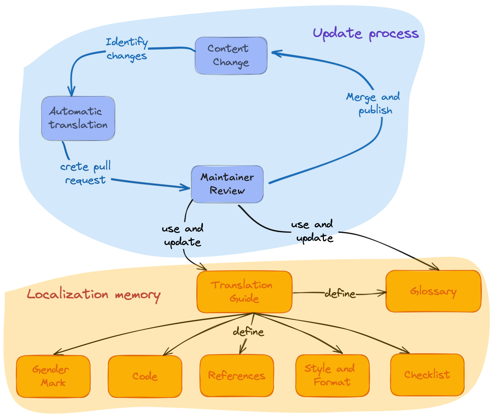

# Overview

> "Meet your community members where they are."

## Introduction

rOpenSci provides community support, standards, and infrastructure for scientists and research software engineers working in R to develop, maintain, and publish high-quality open-source scientific software.
In addition, [we develop and maintain high-quality documentation and resources](https://ropensci.org/resources/) to support these activities.
Many of our materials are defined as *living documents*, meaning that they are constantly being improved and updated.

Multilingual publishing of documentation and resources involves two aspects,
Internationalization and Localization[^intro-wiki]:

-   *Internationalization* refers to technological solutions which allow software to adapt to different regions without requiring changes to the source code.
    This infrastructure is what *enables* us to localize our content.

-   *Localization* is the process of taking a piece of content in its original form and converting it into something accessible and suitable for another region, country, or audience.
    This includes language, date formats, currency, measurement units, and support for different character sets.

[^intro-wiki]: Internationalization and localization.
    Accessed November 1, 2022.
    <https://en.wikipedia.org/wiki/Internationalization_and_localization>

In addition, localization of living documents has two well-defined stages involving different resources:

Stage 1.  Translating the material in the first place.

Stage 2.  Keeping the material updated and synchronized among the supported languages[^intro-yani].

[^intro-yani]: Yanina Bellini Saibene and Natalia Soledad Morandeira.
    Multilingual Data Science: Ten Tips to Translate Science and Tech Content.
    Chapter at Our Environment. A collection of work by data designers, artists, and scientists.
    ISBN:979-8-218-20191-3.

*Translation* is typically the most time-consuming component of these efforts[^intro-wiki].

## Technical infrastructure and workflows

There are many solutions and tools for internationalizing and localizing content and software.
For example, translation management systems (Crowdin, Transifex, Weblate), automatic translators (Google Translate, DeepL), version control systems (GitHub, GitLab), markup languages (LaTeX, Markdown), and tools for writing these languages (Overleaf, Quarto).

These technological solutions are continuously evolving. The choice of technology impacts the paths we create for contributions, so care should be taken to pick technology that reduces barriers to participation as much as possible[^intro-yani].

We developed our infrastructure for our localization effort using the tools that best suit our team, contributors and materials, and thus our community.

* We created the [babeldown package](https://docs.ropensci.org/babeldown/) to create automatic translations of documents, including a workflow for updating existing translations.

* We created the [babelquarto package](https://docs.ropensci.org/babelquarto/) to configure and generate multilingual Quarto books or websites.

* We use GitHub projects to track each localization project's progress and the people who have different contribution roles, like *reviewers*, *editors,* and *maintainers*.

* We also created (and documented in these guidelines) a workflow that follows the same idea of using the tools our community already knows and uses in their activities.

## General aspects of the stage 1 of the translation process

The translation process starts with an initial machine translation using DeepL via the [babeldown](https://docs.ropensci.org/babeldown/) package.
This provides a first draft that is then reviewed by a human, who correct errors and incorporates the localization and [language-specific guidelines](specific_guidelines.html).

To minimize errors and promote a broader perspective of the translation, at rOpenSci we ask that each chapter or section goes through at least two reviews in sequence (first a review of the automatic translation and second a review of the first review) followed by an overall review of the book or document as a whole.

The translation and review process is done on GitHub using *pull requests* (see [the Pull Request section](#pr-edition) for details).
We chose this workflow as this is the infrastructure we use in our community.
All our packages and books are hosted on GitHub and use *issues* and *pull requests* in their development.
In addition, this allows the process to be open so that others can contribute and provide feedback.

Of course, as in all areas of rOpenSci, this is process is subject to our [code of conduct](https://ropensci.org/code-of-conduct/) to create a friendly and safe environment.

{fig-alt="Localization process cycle: we create a Pull Request with the first automatic translation, that translation gets two reviews and then the editor does a final review and merges the changes.  Reviewers and editors update translation guidelines that define the glossary and specific language guidelines"}

## General aspects of the stage 2 of the translation process

In this case we are updating changes in the original language of a content that has already been translated and we have to reflect those changes in the translated languages.

The process is similar to the stage 1 translation process, but with some differences:

1. After the content change in the original language, the maintainer of the translation project creates a new automatic translation using the [babeldown](https://docs.ropensci.org/babeldown/) package.

2. The language maintainer reviews the pull request with the automatic translation and apply the necessary changes.

3. The language maintainer merges the pull request with the review translation.

4. The maintainer updates the language specific translation guidelines and the glossary if necessary.

Maëlle Salmon's blog post [How to Update a Translation with Babeldown](https://ropensci.org/blog/2024/01/16/deepl-update-babeldown/) explain this process in more detail.

{fig-alt="Localization update process cycle: when a change on the content happend we create a Pull Request with the first automatic translation, that translation gets the maintainer reviews and merges the changes.  The maintainer update translation guidelines that define the glossary and specific language guidelines if necessary"}

## Referencing localizations materials

Here we give suggestion for citing a translation or referencing your translation work in a CV. 
These examples specifically refer to the translation of "rOpenSci Packages: Development, Maintenance, and Peer Review",
but you can apply these recommendations to any translation.

### Citing a translation

The general format is[^intro-apa]:

> {Authors of original} ({Year of translation publication}).
> {Translated title} \[{Original title}\]
> (Translation to {Language}: {Authors of translation}).
> {DOI}
> (Original work published {Year of publication})

The text *Translation to* and *Original work published* should be written in the language of the translations.

Example of a citation using the Spanish translation of the rOpenSci Packages: Development, Maintenance, and Peer Review book:

> rOpenSci, Anderson, B., Chamberlain, S., DeCicco, L., Gustavsen, J., Krystalli, A., Lepore, M., Mullen, L., Ram, K., Ross, N., Salmon, M., Vidoni, M., Riederer, E., Sparks, A., & Hollister, J.
> (2021).
> Paquetes rOpenSci: Desarrollo, mantenimiento y revisión por pares \[rOpenSci Packages: Development, Maintenance, and Peer Review\] (Traducción al español: {Authors of translation}).
> <https://doi.org/10.5281/zenodo.6619350> (Trabajo original publicado en 2021)

[^intro-apa]: Based on the APA article ["How to cite translated works"](https://apastyle.apa.org/blog/citing-translated-works).
    We also suggest including the original title in English, following this
    [example for Piaget (1950)](https://writeanswers.royalroads.ca/faq/199295).

### Citing your contribution in your CV

In general, you can use something along the lines of this format:

> {Start date} -- {End date}. Collaborative localization to {Language} of "{Book Name}" (Lead editor {Name of lead editor}). Contribution as {Role}. Project details: {Link to the project}.

Here is a specific example for a CV in English referencing work on a Spanish translation project:

> May, 2022 -- July, 2020. Collaborative localization to Spanish of "rOpenSci Packages: Development, Maintenance, and Peer Review" (Lead editor Yanina Bellini Saibene). Contribution as reviewer. Project details: <https://github.com/ropensci/dev_guide>.

## References
