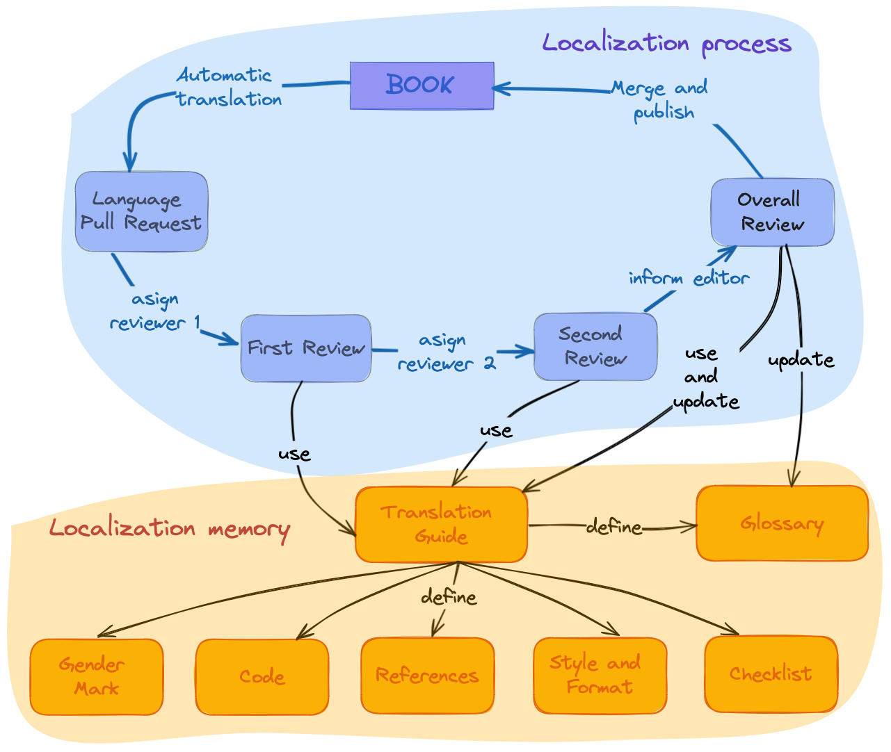

# General Guidelines

> "Meet your community member where they are."

## Introduction

rOpenSci provides community support, standards, and infrastructure for scientists and research software engineers working in R to develop, maintain, and publish high-quality open-source scientific software.
In addition, we develop and maintain high-quality documentation and [resources](/resources/) to support these activities.
Many of our materials are defined as *living documents*, meaning that they are constantly being improved and updated.

Multilingual publishing of documentation and resources involves two aspects:

-   The *internationalization* refers to the technological solution that allows the software to adapt to different regions without requiring engineering changes to the source code.
    It is what enables us to localize our content[^intro-1].

-   The *localization* is the process of taking a piece of content in its original form and converting it into something more accessible and suitable for another region, country, or audience[^intro-2].
    This includes language, date formats, currency, measurement units, and support for different character sets.

[^intro-1]: Internationalization and localization.
    Access November 1, 2022.
    https://en.wikipedia.org/wiki/Internationalization_and_localization

[^intro-2]: Internationalization and localization.
    Access November 1, 2022.
    https://en.wikipedia.org/wiki/Internationalization_and_localization

In addition, the localization of living documents has two well-defined stages involving different resources:

1.  achieving a first version of the translated material and

2.  keeping the material updated and synchronized between the supported languages[^intro-3].

[^intro-3]: Yanina Bellini Saibene and Natalia Soledad Morandeira.
    Multilingual Data Science: Ten Tips to Translate Science and Tech Content.
    Chapter at Our Environment.A collection of work by data designers, artists, and scientists.
    ISBN:979-8-218-20191-3.

*Translation* is typically the most time-consuming component of these efforts[^intro-4].

[^intro-4]: Internationalization and localization.
    Access November 1, 2022.
    https://en.wikipedia.org/wiki/Internationalization_and_localization

## Technical infrastructure and organization of the work

There are many solutions and tools for internationalizing and localizing content and software.
For example, translation management systems (Crowdin, Transifex, Weblate), automatic translators (Google Translate, DeepL), version control systems (GitHub, GitLab), markup languages (LaTeX, Markdown), and tools for writing these languages (Overleaf, Quarto).

These technological solutions are continuously evolving.
We developed our infrastructure for our localization effort using the tools that best suit our team, contributors and materials, and, in summary, our community.
The choice of technology impacts the paths we create for contributions, so they should not be a barrier[^intro-5].

[^intro-5]: Yanina Bellini Saibene and Natalia Soledad Morandeira.
    Multilingual Data Science: Ten Tips to Translate Science and Tech Content.
    Chapter at Our Environment.A collection of work by data designers, artists, and scientists.
    ISBN:979-8-218-20191-3.

We also developed - and documented in these guidelines - a workflow that follows the same idea of using the tools our community already knows and uses in their activities.
We use GitHub projects to track each localization project's progress and the people who have different contribution roles, like *reviewers*, *editors,* and *maintainers*.

{fig-alt="Localization process cicle: we create a Pull Request with the first automatic translation, that translation get two reviews and then the editor do a final revision and merge the changes.  Reviewers and editors updates translations guidelines that define a glossary and agreements around language use."}

## General aspects of the translation process

The translation process starts with a first machine translation using the [babeldown](https://docs.ropensci.org/babeldown/) package.
This provides a first draft that is then reviewed by human eyes, who correct errors and incorporate the localization and language translation agreements (see [Languaje specific guidelines](specific_guidelines.html)).

To minimize errors and maintain a broad look at the translation, we at rOpenSci ask that each chapter or section goes through at least two reviews done in series (the first one reviews the automatic translation and the second reviews the first review) followed by a general review and edition of the book or document as a whole.

In each step of this process, we ask you to:

1.  Use a conversational voice rather than a formal or academic voice.

2.  If appropriate, specify the dialect or regional language variation used.
    For example, the Spanish translation uses Latin American conventions.

3.  Try to be gender-neutral.
    If the language you are working on has a strong grammatical gender, the translation adjusts wording to avoid assigning a gender.
    Where a gender mark cannot be avoided, it uses feminine-masculine or masculine-feminine splits.
    For consistency throughout the text and to show that there is no particular hierarchy, it alternates the use of feminine or masculine between chapters, with the use being consistent throughout each chapter.

4.  Try to be idiomatic.
    Don't be literal, and bring the message closer to your audience.[^intro-6]
    When translating, the text and the form that best expresses the meaning of the fragment in the target language should be prioritized, not the one that seems to be literal from the original.

[^intro-6]: Yanina Bellini Saibene and Natalia Soledad Morandeira.
    Multilingual Data Science: Ten Tips to Translate Science and Tech Content.
    Chapter at Our Environment.A collection of work by data designers, artists, and scientists.
    ISBN:979-8-218-20191-3.

The translation and review process is done on GitHub using *pull requests* (see [this section](#pr-edition) for details).
We chose this workflow as this is the infrastructure we use in our community.
All our packages and books are hosted on GitHub and use *issues* and *pull requests* in their development.
In addition, this allows the process to be open so that others can contribute and provide feedback.

Of course, as in all areas of rOpenSci, we follow our [code of conduct](https://ropensci.org/code-of-conduct/) to create a friendly and safe environment.

## Using the localizations materials

All the next examples use the rOpenSci Packages: Development, Maintenance, and Peer Review localization, but you can apply this recommendations to any of the other translations.

### Citing a translation

We base this recommendation on the [APA recommendations article, Section Book, republished in translation](https://apastyle.apa.org/blog/citing-translated-works).
We recommend including the original title in English, [following this APA suggestion](https://writeanswers.royalroads.ca/faq/199295).
See the example of Piaget (1950).

The general format is:

{list of authors of the English version}.{(year of publication)}.
{Translated title}.
{\[Original Title in English\]} (Translation to {language name}: {list of people that translate the material}).
{DOI}.
(Original work publish at {year of publication})

The text *Translation to* and *Original work publish at* should be written in the language of the translations.

Example using the developer guide and the Spanish translation:

> rOpenSci, Anderson, Brooke, Chamberlain, Scott, DeCicco, Laura, Gustavsen, Julia, Krystalli, Anna, Lepore, Mauro, Mullen, Lincoln, Ram, Karthik, Ross, Noam, Salmon, Maëlle, Vidoni, Melina, Riederer, Emily, Sparks, Adam, & Hollister, Jeff.
> (2021).
> Paquetes rOpenSci: Desarrollo, mantenimiento y revisión por pares \[rOpenSci Packages: Development, Maintenance, and Peer Review\] (Traducción al español: {name of the translators}) Zenodo.
> https://doi.org/10.5281/zenodo.6619350 (Trabajo original publicado en 2021)

### Mention your contribution to a localization project in your CV

-   \<Start date ex.: May, 2022 -- End date, ex: July, 2020\>. Collaborative localization to Spanish of the book ). General edition: Yanina Bellini Saibene. Contribution as \<role, ex.: reviewer\>. More information <link to the project>

## References.
