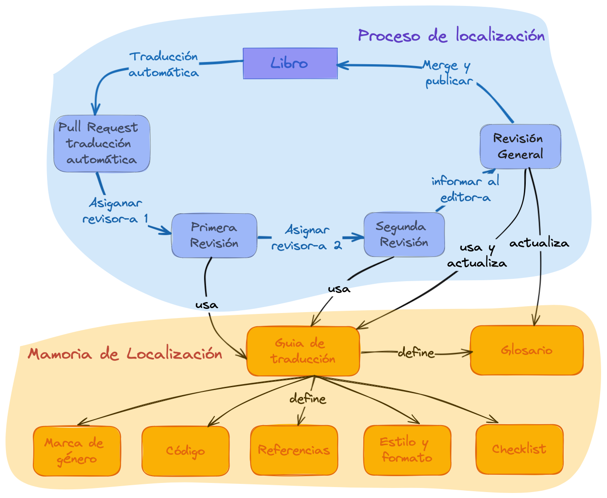

# Directrices generales

> "Encuentrate con las personas de tu comunidad donde están".

## Introducción

rOpenSci proporciona apoyo comunitario, normas e infraestructura para que las personas que hacen ciencia y desarrollan software de investigación con R desarrollen, mantengan y publiquen software científico de código abierto de alta calidad.
Además, [desarrollamos y mantenemos documentación de alta calidad y recursos](https://ropensci.org/resources/) para apoyar estas actividades.
Muchos de nuestros materiales se definen como *documentos vivos* lo que significa que se mejoran y actualizan constantemente.

La publicación multilingüe de documentación y recursos implica dos aspectos, internacionalización y localización[^intro-wiki]: 

- La *internacionalización* se refiere a las soluciones tecnológicas que permite que el software se adapte a diferentes regiones sin requerir cambios de ingeniería en el código fuente.
  Es lo que nos *permite* localizar nuestros contenidos.

- La *localización* es el proceso de tomar un contenido en su forma original y convertirlo en algo accesible y adecuado para otra región, país o público.
  Esto incluye el idioma, los formatos de fecha, la moneda, las unidades de medida y la compatibilidad con distintos juegos de caracteres.

[^intro-wiki]: Internacionalización y localización.
Accedido el 1 de noviembre de 2022.
[https://en.wikipedia.org/wiki/Internationalization\_and\_localization](https://en.wikipedia.org/wiki/Internationalization_and_localization)

Además, la localización de documentos vivos tiene dos etapas bien definidas en las que intervienen distintos recursos:

1. la consecución de una primera versión del material traducido y

2. mantener el material actualizado y sincronizado entre los diferentes idiomas[^intro-yani].

[^intro-yani]: Yanina Bellini Saibene y Natalia Soledad Morandeira.
Ciencia de Datos Multilingüe: Diez Consejos para Traducir Contenidos Científicos y Técnicos.
    Chapter at Our Environment.A collection of work by data designers, artists, and scientists.
ISBN:979-8-218-20191-3.

La *traducción* suele ser el componente que más tiempo consume en estos esfuerzos[^intro-wiki].

## Infraestructura técnica y organización del trabajo

Existen muchas soluciones y herramientas para internacionalizar y localizar contenidos y software.
Por ejemplo, sistemas de gestión de traducción (Crowdin, Transifex, Weblate), traductores automáticos (Google Translate, DeepL), sistemas de control de versiones (GitHub, GitLab), lenguajes de marcado (LaTeX, Markdown) y herramientas para escribir estos lenguajes (Overleaf, Quarto).

Estas soluciones tecnológicas están en continua evolución. La elección de la tecnología influye en las posibilidades que creamos para las contribuciones, por lo que hay que procurar elegir una tecnología que reduzca al máximo las barreras a la participación.[^intro-yani].

Desarrollamos nuestra infraestructura para nuestras localizaciones, utilizando las herramientas que mejor se adaptan a nuestro equipo, colaboradores y materiales y, por lo tanto, a nuestra comunidad.

* Creamos [el paquete babeldown](https://docs.ropensci.org/babeldown/) para realizar una primera traducción automática de los documentos, incluyendo un proceso para actualizar traducciones existentes.

* Creamos [el paquete babelquarto](https://docs.ropensci.org/babelquarto/) para configurar y generar libros o sitios web multilingues con Quarto .

* Utilizamos [proyectos de GitHub](https://github.com/orgs/ropensci/projects/7/views/1) para hacer un seguimiento del progreso de cada proyecto de localización y de las personas que tienen diferentes funciones de contribución, como *revisores*, *editoras,* y personas encargadas del *mantenimiento*.

* También desarrollamos, y documentamos en estas directrices, un flujo de trabajo que sigue la misma idea de utilizar las herramientas que nuestra comunidad ya conoce y utiliza en sus actividades.

## Aspectos generales del proceso de traducción

El proceso de traducción comienza con una primera traducción automática utilizando DeepL via el paquete [babeldown](https://docs.ropensci.org/babeldown/).
Esto proporciona un primer borrador que luego es revisado por uan persona, que corrigen los errores e incorporan los acuerdos de localización y traducción lingüística detallados en las [Directrices específicas de cada idioma](specific_guidelines.html).

Para minimizar los errores y promover una visión amplia de la traducción, en rOpenSci pedimos que cada capítulo o sección pase al menos por dos revisiones hechas en serie (la primera revisa la traducción automática y la segunda revisa la primera revisión), seguidas de una revisión general del libro o documento en su conjunto.

En cada paso de este proceso, usamos las siguientes pautas:

1. Utilices una voz conversacional en lugar de una voz formal o académica.

2. Si procede, especifica el dialecto o la variante lingüística regional utilizada.
  Por ejemplo, la traducción al español utiliza las convenciones latinoamericanas.

3. Intenta ser neutral en cuanto al género.
  Si la lengua en la que estás trabajando tiene un género gramatical fuerte, la traducción ajusta la redacción para evitar asignar un género.
  Cuando no se pueda evitar la marca de género, utiliza divisiones femenino-masculino o masculino-femenino.
  Para mantener la coherencia a lo largo del texto y mostrar que no existe una jerarquía determinada, alterna el uso del femenino o del masculino entre capítulos, siendo el uso coherente a lo largo de cada capítulo.

4. Intenta ser idiomático.
  No te preocupes por las traducciones literales. Acerca el mensaje a su audiencia[^intro-yani] eligiendo el texto y la forma en la lengua a traducir que mejor expresen el *significado* del fragmento del original.  
  
El proceso de traducción y revisión se realiza en GitHub utilizando *pull requests* (consulta [la sección de pull request](#pr-edition) para más detalles).
Elegimos este flujo de trabajo porque es la infraestructura que utilizamos en nuestra comunidad.
Todos nuestros paquetes y libros están alojados en GitHub y utilizan *issues* y *pull requests* en su desarrollo.
Nuestro proceso de revision de software por pares tambien se realiza en GitHub utilizando las mismas herramientas. 
Además, esto permite que el proceso sea abierto para que otras personas puedan contribuir y aportar devoluciones.

Por supuesto, como en todas las áreas de rOpenSci, este proceso está sujeto a nuestro [código de conducta](https://ropensci.org/code-of-conduct/) para crear un entorno amigable y seguro.

{fig-alt="Ciclo del proceso de localización: creamos una Pull Request con la primera traducción automática, esa traducción recibe dos revisiones y luego quien edita hace una revisión final y hace un merge de los cambios. Estas personas actualizan las pautas de traducción que definen el glosario y los acuerdos especificos del idioma."}

## Referenciar y utilizar los materiales de localización

A continuación ofrecemos sugerencias para citar una traducción o hacer referencia a tu trabajo de traducción en un CV. 
Estos ejemplos se refieren específicamente a la traducción de "Paquetes de rOpenSci: Desarrollo, mantenimiento y revisión por pares",
pero puede aplicar estas recomendaciones a cualquier traducción.

### Citar una traducción

El formato general es[^intro-apa]:

> {Autores/as de la version en el idioma original}.{(año de publicación)}.
> {Título traducido}.
> {[Título original en el idioma original]} (Traducción a {idioma}: {Autoras/es de la traducción}).
> {DOI}.
> (Trabajo original publicado en {year of publication})

El texto *Traducción a* y *Obra original publicada en* deben estar escritos en la lengua de las traducciones.

Ejemplo utilizando la traducción al español del libro "Paquetes de rOpenSci: Desarrollo, mantenimiento y revisión por pares":

> rOpenSci, Anderson, B., Chamberlain, S., DeCicco, L., Gustavsen, J., Krystalli, A., Lepore, M., Mullen, L., Ram, K., Ross, N., Salmon, M., Vidoni, M., Riederer, E., Sparks, A., & Hollister, J.
> (2021).
> Paquetes rOpenSci: Desarrollo, mantenimiento y revisión por pares [rOpenSci Packages: Development, Maintenance, and Peer Review] (Traducción al español: {nombre de los traductores}) Zenodo.
> [https://doi.org/10.5281/zenodo.6619350](https://doi.org/10.5281/zenodo.6619350) (Trabajo original publicado en 2021)

[^intro-apa]: Basamos esta recomendación en el [artículo de recomendaciones de la APA, Sección Libro, reeditado en traducción](https://apastyle.apa.org/blog/citing-translated-works).
              También recomendamos incluir el título en el idioma original, [siguiendo este ejemplo de Piaget (1950)](https://writeanswers.royalroads.ca/faq/199295).

### Menciona tu contribución en tu CV

En general, puedes utilizar algo parecido a este formato:

> {Fecha de inicio} -- {Fecha de finalización}. Localización colaborativa al {idioma} de "{nombre del material/libro}" (Edición general: {nombre completo}). Contribución como {role}. Detalles del proyecto: {Link al proyecto}.

Este es un ejemplo concreto de CV en inglés que hace referencia a un proyecto de traducción al español:

> Mayo 2020 -- Julio 2022. Localización colaborativa al español del libro "rOpenSci Packages: Development, Maintenance, and Peer Review" (Lead editor Yanina Bellini Saibene). Contribución como revisor. Detalles del proyecto: <https://github.com/ropensci/dev_guide>.

