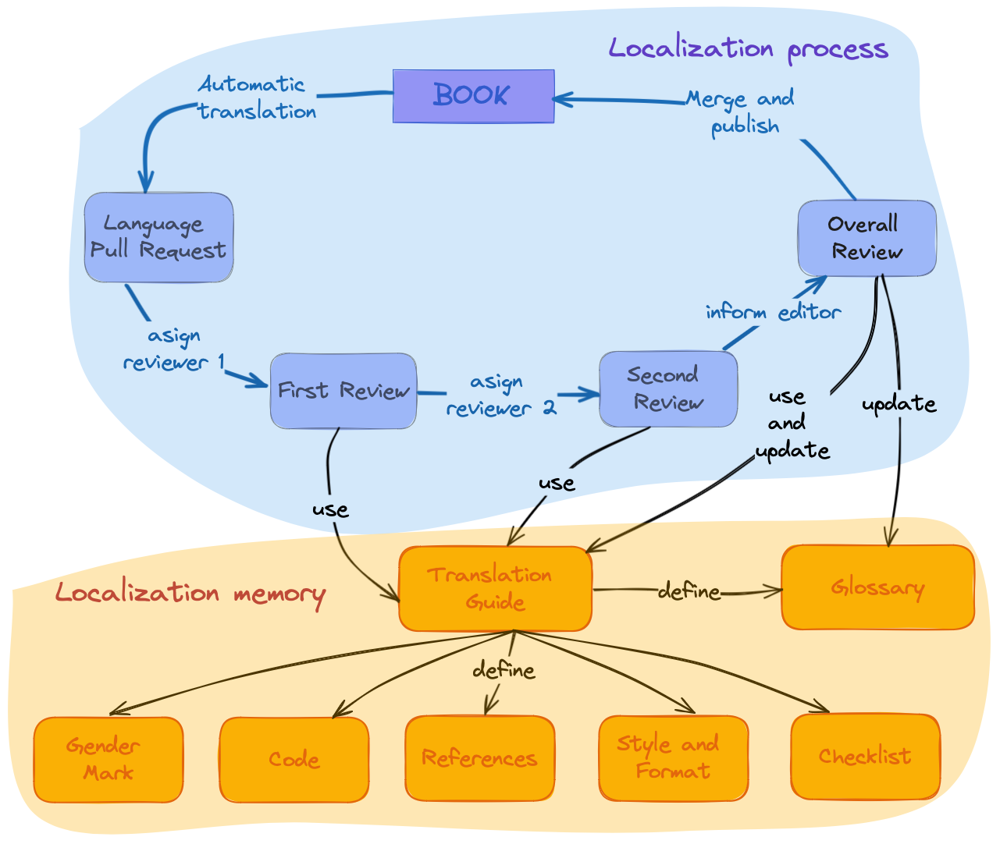

# Directrices generales

> "Encuentra a las personas de tu comunidad donde están".

## Introducción

rOpenSci proporciona apoyo comunitario, normas e infraestructura para que las personas que hacen ciencia y desarrollan software de investigación con R desarrollen, mantengan y publiquen software científico de código abierto de alta calidad.
Además, [desarrollamos y mantenemos documentación de alta calidad y recursos](https://ropensci.org/resources/) para apoyar estas actividades.
Muchos de nuestros materiales se definen como *documentos vivos* lo que significa que se mejoran y actualizan constantemente.

La publicación multilingüe de documentación y recursos implica dos aspectos:

- La *internacionalización*, que se refiere a la solución tecnológica que permite que el software se adapte a diferentes regiones sin requerir cambios de ingeniería en el código fuente.
  Es lo que nos permite localizar nuestros contenidos[^intro-1].

- La *localización*, que es el proceso de tomar un contenido en su forma original y convertirlo en algo accesible y adecuado para otra región, país o público[^intro-2].
  Esto incluye el idioma, los formatos de fecha, la moneda, las unidades de medida y la compatibilidad con distintos juegos de caracteres.

[^intro-1]: Internacionalización y localización.
Acceso el 1 de noviembre de 2022.
[https://en.wikipedia.org/wiki/Internationalization\_and\_localization](https://en.wikipedia.org/wiki/Internationalization_and_localization)

[^intro-2]: Internacionalización y localización.
Acceso el 1 de noviembre de 2022.
[https://en.wikipedia.org/wiki/Internationalization\_and\_localization](https://en.wikipedia.org/wiki/Internationalization_and_localization)

Además, la localización de documentos vivos tiene dos etapas bien definidas en las que intervienen distintos recursos:

1. la consecución de una primera versión del material traducido y

2. mantener el material actualizado y sincronizado entre los diferentes idiomas[^intro-3].

[^intro-3]: Yanina Bellini Saibene y Natalia Soledad Morandeira.
Ciencia de Datos Multilingüe: Diez Consejos para Traducir Contenidos Científicos y Técnicos.
    Chapter at Our Environment.A collection of work by data designers, artists, and scientists.
ISBN:979-8-218-20191-3.

La *traducción* suele ser el componente que más tiempo consume en estos esfuerzos[^intro-4].

[^intro-4]: Internacionalización y localización.
Acceso el 1 de noviembre de 2022.
[https://en.wikipedia.org/wiki/Internationalization\_and\_localization](https://en.wikipedia.org/wiki/Internationalization_and_localization)

## Infraestructura técnica y organización del trabajo

Existen muchas soluciones y herramientas para internacionalizar y localizar contenidos y software.
Por ejemplo, sistemas de gestión de traducción (Crowdin, Transifex, Weblate), traductores automáticos (Google Translate, DeepL), sistemas de control de versiones (GitHub, GitLab), lenguajes de marcado (LaTeX, Markdown) y herramientas para escribir estos lenguajes (Overleaf, Quarto).

Estas soluciones tecnológicas están en continua evolución. La elección de la tecnología influye en las rutas de acceso que creamos para las contribuciones, por lo que no debe ser una barrera[^intro-5].

[^intro-5]: Yanina Bellini Saibene y Natalia Soledad Morandeira.
Ciencia de Datos Multilingüe: Diez Consejos para Traducir Contenidos Científicos y Técnicos.
    Chapter at Our Environment.A collection of work by data designers, artists, and scientists
ISBN:979-8-218-20191-3.

Desarrollamos nuestra infraestructura para nuestras localizaciones, utilizando las herramientas que mejor se adaptan a nuestro equipo, colaboradores y materiales y, en resumen, a nuestra comunidad.

* [El paquete babeldown](https://docs.ropensci.org/babeldown/)permite realizar una primera traducción automática de los documentos.

* [El paquete babelquarto](https://docs.ropensci.org/babelquarto/) permite configurar y generar un libro o una web de Quarto multilingue.

* Utilizamos [proyectos de GitHub](https://github.com/orgs/ropensci/projects/7/views/1) para hacer un seguimiento del progreso de cada proyecto de localización y de las personas que tienen diferentes funciones de contribución, como *revisores*, *editoras,* y personas encargadas del *mantenimiento*.

* También desarrollamos -y documentamos en estas directrices- un flujo de trabajo que sigue la misma idea de utilizar las herramientas que nuestra comunidad ya conoce y utiliza en sus actividades.

## Aspectos generales del proceso de traducción

El proceso de traducción comienza con una primera traducción automática utilizando el paquete [babeldown](https://docs.ropensci.org/babeldown/).
Esto proporciona un primer borrador que luego es revisado por ojos humanos, que corrigen los errores e incorporan los acuerdos de localización y traducción lingüística (ver [Directrices específicas de cada idioma](specific_guidelines.html)).

Para minimizar los errores y mantener una visión amplia de la traducción, en rOpenSci pedimos que cada capítulo o sección pase al menos por dos revisiones hechas en serie (la primera revisa la traducción automática y la segunda revisa la primera revisión), seguidas de una revisión general y una edición del libro o documento en su conjunto.

En cada paso de este proceso, te pedimos que

1. Utilices una voz conversacional en lugar de una voz formal o académica.

2. Si procede, especifica el dialecto o la variante lingüística regional utilizada.
  Por ejemplo, la traducción al español utiliza las convenciones latinoamericanas.

3. Intenta ser neutral en cuanto al género.
  Si la lengua en la que estás trabajando tiene un género gramatical fuerte, la traducción ajusta la redacción para evitar asignar un género.
  Cuando no se pueda evitar la marca de género, utiliza divisiones femenino-masculino o masculino-femenino.
  Para mantener la coherencia a lo largo del texto y mostrar que no existe una jerarquía determinada, alterna el uso del femenino o del masculino entre capítulos, siendo el uso coherente a lo largo de cada capítulo.

4. Intenta ser idiomático.
  No seas literal y acerca el mensaje a tu audiencia[^intro-6].
  Al traducir, hay que dar prioridad al texto y a la forma que mejor exprese el significado del fragmento en la lengua de llegada, no al que parezca literal del original.

[^intro-6]: Yanina Bellini Saibene y Natalia Soledad Morandeira.
Ciencia de Datos Multilingüe: Diez Consejos para Traducir Contenidos Científicos y Técnicos.
    Chapter at Our Environment.A collection of work by data designers, artists, and scientists.
ISBN:979-8-218-20191-3.

El proceso de traducción y revisión se realiza en GitHub utilizando *pull requests* (consulta [esta sección](#pr-edition) para más detalles).
Elegimos este flujo de trabajo porque es la infraestructura que utilizamos en nuestra comunidad.
Todos nuestros paquetes y libros están alojados en GitHub y utilizan *issues* y *pull requests* en su desarrollo.
Además, esto permite que el proceso sea abierto para que otras personas puedan contribuir y aportar devoluciones.

Por supuesto, como en todas las áreas de rOpenSci, seguimos nuestro [código de conducta](https://ropensci.org/code-of-conduct/) para crear un entorno amistoso y seguro.

{fig-alt="Ciclo del proceso de localización: creamos una Pull Request con la primera traducción automática, esa traducción recibe dos revisiones y luego quien edita hace una revisión final y fusiona los cambios.  Estas personas actualizan las directrices de traducción que definen un glosario y los acuerdos sobre el uso del idioma."}

## Utilizar los materiales de localización

Todos los ejemplos siguientes utilizan la localización del libro Paquetes rOpenSci: Development, Maintenance, and Peer Review, pero puedes aplicar estas recomendaciones a cualquiera de las otras traducciones.

### Citar una traducción

Basamos esta recomendación en la [artículo de recomendaciones de la APA, Sección Libro, reeditado en traducción](https://apastyle.apa.org/blog/citing-translated-works).
Recomendamos incluir el título original en inglés, [siguiendo esta sugerencia de la APA](https://writeanswers.royalroads.ca/faq/199295).
Véase el ejemplo de Piaget (1950).

El formato general es

{lista de autores de la version en el idioma original}.{(año de publicación)}.
{Título traducido }.
{[Título original en el idioma original]} (Traducción a {nombre del idioma}: {lista de personas que hicieron la traducción del material}).
{DOI}.
(Trabajo original publicado en {year of publication})

El texto *Traducción a* y *Obra original publicada en* deben estar escritos en la lengua de las traducciones.

Ejemplo utilizando la guía del desarrollador y la traducción al español:

> rOpenSci, Anderson, Brooke, Chamberlain, Scott, DeCicco, Laura, Gustavsen, Julia, Krystalli, Anna, Lepore, Mauro, Mullen, Lincoln, Ram, Karthik, Ross, Noam, Salmon, Maëlle, Vidoni, Melina, Riederer, Emily, Sparks, Adam y Hollister, Jeff.
> (2021).
> Paquetes rOpenSci: Desarrollo, mantenimiento y revisión por pares [rOpenSci Packages: Development, Maintenance, and Peer Review] (Traducción al español: {name of the translators}) Zenodo.
> [https://doi.org/10.5281/zenodo.6619350](https://doi.org/10.5281/zenodo.6619350) (Trabajo original publicado en 2021)

### Menciona tu contribución a un proyecto de localización en tu CV

- \<Fecha de inicio, por ejemplo: mayo de 2022 -- Fecha de finalización, por ejemplo: julio de 2020>. Localización colaborativa al español del libro ). Edición general: Yanina Bellini Saibene. Contribución como \<rol, ej.: revisor>. Más información <enlace al proyecto>

## Agrega a tu CV tu contribución a un proyecto de localización

